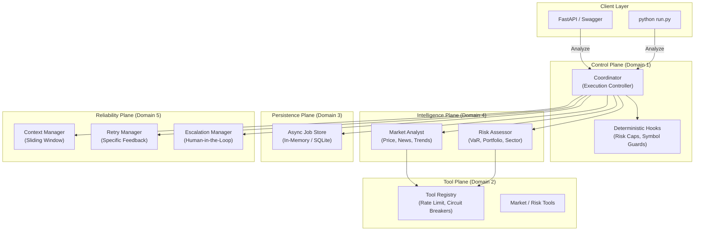

# 🤖 Claude Certified Architect: Production Trading System

[](https://fastapi.tiangolo.com/)
[](https://www.anthropic.com/claude)
[](https://www.docker.com/)
[](https://docs.pytest.org/)

An immersive, production-grade, multi-agent trading analysis system explicitly architected to align with the **Claude Certified Architect – Foundations Certification Exam Guide**. This repository is not just a trading app—it is a study in advanced agentic engineering.

Every component, interface, and guardrail in this project maps directly to the five exam domains, assuring deterministic safety, reliable execution, and structured intelligence.

---

## 🏛 Architecture Overview — The Hub-and-Spoke Model



---

## 🌟 Alignment with Exam Domains & Task Statements

This system serves as a live implementation of the exam capabilities. Here is how our architecture explicitly maps to the knowledge requirements.

### Domain 1: Agentic Architecture & Orchestration
*   **Task 1.1: Design and implement agentic loops**  
    Our `BaseAgent.run()` method does not parse text (an explicit anti-pattern). It operates entirely on `stop_reason` ("tool_use" vs "end_turn"), safely appending results to context strings to maintain history tracking.
*   **Task 1.2 & 1.3: Orchestrate multi-agent systems & Subagent context passing**  
    The `CoordinatorAgent` acts as a Hub, dynamically selecting subagents (`MarketAnalyst` and `RiskAssessor`), and dispatching tasks without polluting them with unnecessary parent conversation history. We enforce **isolated context** to remove "self-review bias."
*   **Task 1.4 & 1.5: Programmatic Enforcement & Hooks**  
    We abide by **"Hooks > Prompts"**. The LLM is supervised via intercepting lifecycle hooks (`validate_tool_call` and `validate_result`) enforcing deterministic rule bounds (e.g., max position size capping at $1,000,000) long before any network tool or human reviews the generated payload.

### Domain 2: Tool Design & MCP Integration
*   **Task 2.1 & 2.3: Tool Interfaces and Scoping**  
    We heavily restrict tool scope, exposing a max of 4 tools per agent to prevent cognitive overload. We use detailed JSON-schema descriptions and clear boundaries, meaning the `MarketAnalyst` only sees analytics utilities, and the `RiskAssessor` only accesses portfolio controls.
*   **Task 2.2: Structured Error Responses**  
    Rather than generic exceptions logging, our `ToolRegistry` emits strongly-typed JSON error metadata utilizing an `ErrorCode` enum and an `is_error=True` flag (akin to MCP `isError`). We supply specific error messages like "Invalid symbol format" rather than "Try again", thus preventing endless retry loops.

### Domain 3: Claude Code Configuration & Workflows
*   **Task 3.1 & 3.2: Configuration & Skills**  
    We have structured our repository according to Claude Code practices, providing team instructions inside `CLAUDE.md`, and organizing `.claude/skills/trading_agent/SKILL.md` equipped with contextual YAML frontmatter (`context: fork`, `allowed-tools`) allowing for targeted, safe code-generation skills and commands.
*   **Task 3.6: CI/CD Workflows**  
    To ensure integration capabilities, our build and tests execute via lightweight Dockerfiles and fully headless Pytest integrations that safely pass without necessitating runtime LLM access.

### Domain 4: Prompt Engineering & Structured Output
*   **Task 4.1 & 4.2: Explicit Criteria and Few-Shot**  
    Our subagents are deployed with explicitly defined categorical boundaries (e.g., `Confidence Output between 0.0 - 1.0`). We bypass verbose NLP prompting styles for concrete **few-shot structured JSON examples** showing proper ambiguous-case handling directly in the prompt templates.
*   **Task 4.3 & 4.4: Enforce Structured Output & Retry loops**  
    We mandate Pydantic schema validation as the primary integration interface. Our post-completion hooks run programmatic verification on output contents before submission. For any validation faults, agents re-invoke utilizing explicit debug traces to "self-correct" failures inside a bounded iteration limit.

### Domain 5: Context Management & Reliability
*   **Task 5.1: Preserve Environment across Long Interactions**  
    To sidestep the "lost in the middle" effect across massive orchestrations, the `ContextManager` uses a sliding-window array summary feature. Critical "key decision" boundaries are explicitly extracted and appended permanently to prompt blocks preventing temporal data regression. 
*   **Task 5.2: Escalations & Resolution**  
    The `EscalationManager` avoids naive confidence-based overrides. It triggers deterministic **Human-in-the-Loop** interrupts if VaR caps are exceeded or if multi-agent reviews present unsolvable contradictions (as per the exam scenarios on ambiguity routing).

---

## 🛠 Project Structure

| Directory | Purpose | Domain |
|-----------|---------|--------|
| `agents/` | Hub, Spokes, Hooks and Context Management | 1, 5 |
| `tools/` | ToolRegistry, Rate Limiter, Circuit Breakers | 2 |
| `models/` | Pydantic Schemas (The System Contracts) | 4 |
| `prompts/` | Few-shot examples & Identity Templates | 4 |
| `config/` | Environment-driven settings and risk limits | 3 |
| `.claude/`| Claude Code custom Skills and commands | 3 |
| `server.py` | FastAPI application with polling pattern | 3 |
| `tests/` | 33-test suite covering every critical path | ALL |

---

## 🚀 Quick Start — Get Running in 2 Minutes

### 1. Requirements
Ensure you have Python 3.13+ and Docker installed.

### 2. Configuration
```bash
cd trading-agent
cp .env.example .env
# Edit .env and your ANTHROPIC_API_KEY
```

### 3. Run with Docker Compose (Recommended)
```bash
docker compose up --build
```
> Explore the API at [http://localhost:8000/docs](http://localhost:8000/docs)

### 4. Run CLI Analysis
```bash
# Analyze AAPL
python run.py AAPL
```

---

## 🧪 Testing the Guardrails (Offline)

The system comes with a comprehensive test suite that validates the **Agent Infrastructure** WITHOUT requiring an Anthropic API key.

```bash
python3 -m pytest tests/test_system.py -v
```

**Test Coverage Highlights:**
- ✅ **Schema Validation**: Tests that models catch non-compliant agent outputs (Task 4.3)
- ✅ **Tool Registry**: Ensures rate limits block overuse and circuit breaker logic prevents cascade faults (Task 2.2)
- ✅ **Context Management**: Proves context compression and key decision persistence works across iterations (Task 5.1)
- ✅ **System Config**: Validates hardcoded programmatic prerequisites and position threshold limits (Task 1.4)
- ✅ **Escalation**: Demonstrates deterministic agent-to-human workflows (Task 5.2)

---

> *"Hooks > Prompts. A prompt suggests a rule; a code hook enforces it."* 
> — System Design Principle
